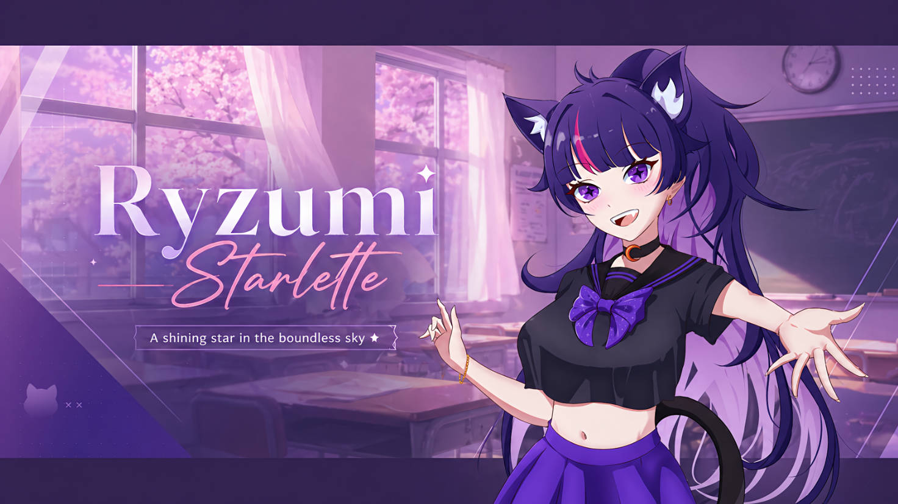

# Ryzumi-WABot V2

Ryzumi-WABot V2 adalah asisten bot WhatsApp cerdas yang dibangun menggunakan NodeJS dan *library* `@whiskeysockets/baileys`. Bot ini menggunakan arsitektur *Plugin-Based* yang modern, sangat cepat, teroptimasi untuk lalu lintas pesan tingkat tinggi (High-Traffic), dan ringan untuk dijalankan di perangkat atau server dengan spesifikasi rendah.

## Fitur Utama
- **Arsitektur Modular (Plugins)**: Mudah diperluas dan di-*maintenance*.
- **Hot-Reload**: Anda bisa mengedit dan menambahkan plugin tanpa harus merestart bot.
- **Anti-Ban Protection**: Dilengkapi dengan simulasi pengetikan (typing simulator) dan pembatasan kecepatan koneksi agar aman dari *banned* WhatsApp.
- **Database Terintegrasi**: Menggunakan Sequelize ORM (mendukung SQLite, MySQL, MariaDB).
- **Fast-Path Event Loop**: Ekstraksi pesan yang dioptimalkan agar tidak "bengong" saat grup sedang ramai.

## Persyaratan Sistem
- NodeJS versi 18+ (Rekomendasi v20 LTS)
- RAM minimal 512MB
- Jaringan internet yang stabil
- **FFmpeg** (Untuk konversi Audio & Video)
- **ImageMagick** (Untuk manipulasi gambar dan pembuatan Stiker)

---

## 🚀 Cara Install & Setup

1. **Install Paket Eksternal (FFmpeg & ImageMagick)**
   Bot ini membutuhkan *tools* eksternal untuk mengelola file media.
   
   *Di Ubuntu/Debian:*
   ```bash
   sudo apt-get update
   sudo apt-get install ffmpeg imagemagick -y
   ```
   *Di Windows:*
   Gunakan [Scoop](https://scoop.sh/) atau unduh manual:
   ```cmd
   scoop install ffmpeg imagemagick
   ```

2. **Clone Repositori**
   ```bash
   git clone https://github.com/ShirokamiRyzen/Ryzumi-WABot-V2.git
   cd Ryzumi-WABot-V2
   ```

2. **Install Dependensi**
   Pastikan Anda berada di dalam folder bot, lalu jalankan perintah:
   ```bash
   npm install
   ```

3. **Konfigurasi Lingkungan (Environment)**
   Ubah nama file `.env.example` menjadi `.env`, lalu isi konfigurasinya sesuai kebutuhan Anda (seperti kredensial database dan info pemilik bot).
   ```bash
   # Di Linux/Mac
   cp .env.example .env
   ```

4. **Jalankan Bot**
   Jalankan bot untuk pertama kalinya. Bot akan menampilkan QR Code di layar.
   ```bash
   npm start
   ```
   *Scan QR Code tersebut menggunakan perangkat WhatsApp Anda melalui menu Tautkan Perangkat (Linked Devices).*

---

## 💾 Backup Database Otomatis & Sinkronisasi Nextcloud

Bot ini memiliki fitur pencadangan (backup) database otomatis yang dirancang khusus untuk lingkungan **Docker** (berjalan murni dengan NodeJS, tanpa bergantung pada `mysqldump` eksternal).

### Fitur Utama Backup:
*   **Pemicu Otomatis (Cron)**: Berjalan setiap hari pada pukul **00:00 (12 malam) WIB** (`Asia/Jakarta`).
*   **Aman di Docker**: Tidak membutuhkan CLI `mysqldump` eksternal, melainkan menggunakan kueri internal NodeJS.
*   **Sinkronisasi Cloud**: Otomatis mengunggah file cadangan (`.sql` atau `.sqlite`) ke server **Nextcloud** melalui protokol WebDAV.
*   **Pembersihan Mandiri (Auto-Clean)**: Menghapus file lokal di dalam container Docker setelah berhasil diunggah ke Nextcloud, guna menghindari penggunaan ruang disk secara berlebih.
*   **Perintah Manual**: Khusus Owner bot dapat mengetik perintah `.backup` atau `.backupdb` langsung di WhatsApp. Bot akan mencadangkan database secara instan dan mengirimkan berkas `.sql` / `.sqlite` langsung sebagai dokumen WhatsApp.

### Cara Konfigurasi (di `.env`):
Isi variabel berikut pada file `.env` Anda:
```env
NEXTCLOUD_URL="https://nextcloud.kamu.com"  # URL Nextcloud
NEXTCLOUD_USER="username"                   # Username akun Nextcloud
NEXTCLOUD_PASSWORD="app-password"           # App Password Nextcloud
NEXTCLOUD_PATH="RyzumiMD-DB-Backup/"        # Path folder di Nextcloud
```

---

## 🛠️ Cara Menambah Fitur / Plugin Baru

Ryzumi V2 menggunakan sistem plugin yang sangat mudah dikembangkan. Semua fitur diletakkan di dalam folder `plugins/`. Setiap kali Anda membuat atau mengedit plugin, bot akan secara otomatis memuatnya secara *Hot-Reload* (tanpa perlu direstart).

### Struktur Dasar Plugin
Buat sebuah file Javascript (misalnya `tool-hello.js`) di dalam folder kategori yang sesuai (contoh: `plugins/tool/`).

```javascript
export default {
    // 1. Nama perintah (command) yang memicu plugin ini
    command: ['.hello', '.hai', '.halo'],

    // 2. Kategori untuk ditampilkan di menu
    category: 'tool',

    // 3. Deskripsi fitur
    description: 'Menyapa bot Ryzumi',

    // 4. Konfigurasi Akses & Limitasi
    is_group: false,    // Apakah hanya bisa digunakan di grup?
    is_private: false,  // Apakah hanya bisa digunakan di private chat?
    is_owner: false,    // Apakah khusus Owner?
    is_premium: false,  // Apakah khusus member Premium?
    is_admin: false,    // Apakah khusus Admin grup?
    is_botadmin: false, // Apakah bot harus menjadi admin grup?
    is_registered: true, // Apakah user harus daftar dulu?
    limit: 1,           // Pengurangan limit setiap kali digunakan
    cooldown: 5,        // Jeda (cooldown) dalam detik per user

    // 5. Eksekusi Utama
    async execute(sock, m, msgData, user, group) {
        // Ekstrak properti dari msgData
        const { reply, pushName } = msgData;

        // Balas pesan pengguna
        await reply(`Konbanwa, ${pushName} kak! Ryzumi siap membantu~ (˶˃ ᵕ ˂˶)`);
    }
};
```

### Penjelasan Variabel Eksekusi:
Fungsi `execute` akan menerima 5 parameter utama:
1. `sock`: Instance langsung dari Baileys socket. Anda bisa menggunakannya untuk kontrol penuh.
2. `m`: Objek pesan asli mentah dari WhatsApp.
3. `msgData`: **Adapter Super** bawaan Ryzumi yang merangkum semua fungsi dan properti.
4. `user`: Objek profil user pengirim dari database.
5. `group`: Objek profil grup dari database (jika pesan dikirim di grup).

#### Properti `msgData` yang sering digunakan:
*   `msgData.remoteJid` : ID chat (Grup/Private)
*   `msgData.senderJid` : ID pengirim pesan
*   `msgData.pushName`  : Nama kontak pengirim
*   `msgData.args`      : Array dari argumen (misal: mengetik `.cari anime naruto`, maka `args[0] = 'anime'` dan `args[1] = 'naruto'`).
*   `msgData.messageContent` : Isi pesan teks lengkap (tanpa awalan).
*   `msgData.isQuoted`  : Bernilai `true` jika user membalas (*reply*) sebuah pesan.
*   `msgData.downloadMedia()` : Fungsi async untuk mendownload media dari pesan yang dikirim/dibalas.
*   `msgData.reply(text)` : Fungsi instan untuk membalas pesan.
*   `msgData.react(emoji)`: Fungsi instan untuk memberi reaksi pada pesan.

---

## 📝 Lisensi
Distribusi ulang dan penggunaan *source code* ini diizinkan mengikuti ketentuan [MIT License](LICENSE). 

**PENGECUALIAN HAK CIPTA (COPYRIGHT EXCEPTION):**
Ketentuan lisensi terbuka di atas **TIDAK BERLAKU** untuk semua *asset artwork*, karakter, dan konten visual/suara yang digunakan pada bot ini maupun yang di-*hosting* di server `s3.ryzumi.net`. Seluruh *asset* tersebut memiliki Hak Cipta penuh milik **Ryzumi Network**. Dilarang keras menjiplak, melakukan *tracing*, mereproduksi, atau mencuri *artwork* asli tersebut untuk keperluan bot lain atau komersial tanpa izin tertulis.
